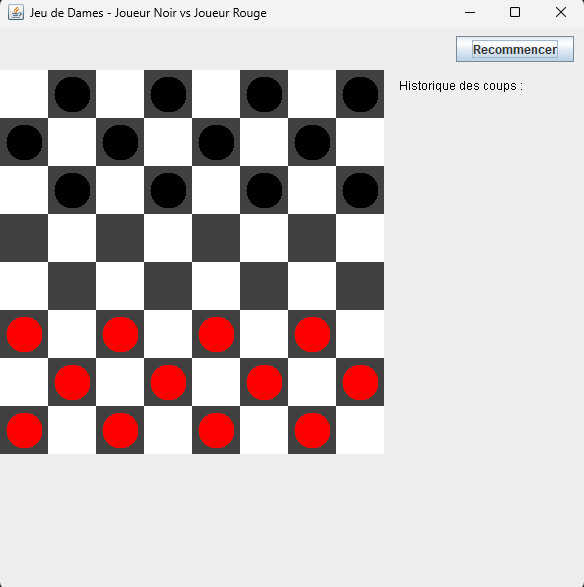

# Jeu de Dames en Java

## Présentation
Ce projet est un jeu de dames classique, développé en Java avec une interface graphique Swing. Il permet à deux joueurs de s'affronter sur le même ordinateur, avec les déplacements diagonaux, les captures, la promotion en dame, l'alternance des joueurs et l'historique des coups.

## Installation et Lancement
1. **Prérequis** : Java JDK 8 ou supérieur installé.
2. **Compilation** :
   - Placez-vous dans le dossier du projet.
   - Compilez tous les fichiers Java :
     ```
  javac -d out app/*.java model/*.java view/*.java
     ```
3. **Exécution** :
   - Lancez le jeu avec :
     ```
  java -cp out app.Main
     ```

## Justification du choix de Swing
Swing a été choisi pour l'interface graphique car :
- Il est inclus dans le JDK standard, donc aucune dépendance externe n'est nécessaire.
- Il est bien documenté et adapté à l'apprentissage de la programmation graphique en Java.
- Il permet de créer rapidement des interfaces réactives et personnalisées.
- La majorité des ressources pédagogiques pour débuter en Java utilisent Swing.

## Aperçu


## Structure du projet
- `app/Main.java` : point d'entrée du programme
- `view/PageAccueil.java` : écran d'accueil
- `view/Interfacegraphique.java` : création de la fenêtre principale
- `view/PlateauGraphique.java` : affichage du damier, gestion des clics, historique
- `model/Plateau.java`, `model/Case.java`, `model/Piece.java`, `model/Pion.java`, `model/Dame.java` : logique du jeu et des pièces
- `model/Joueur.java`, `model/Jeu.java` : gestion des joueurs et du déroulement

## Auteurs
- Mustafa
- Rayann
